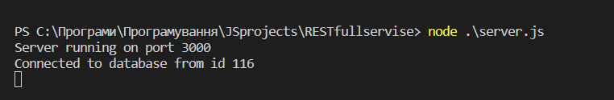
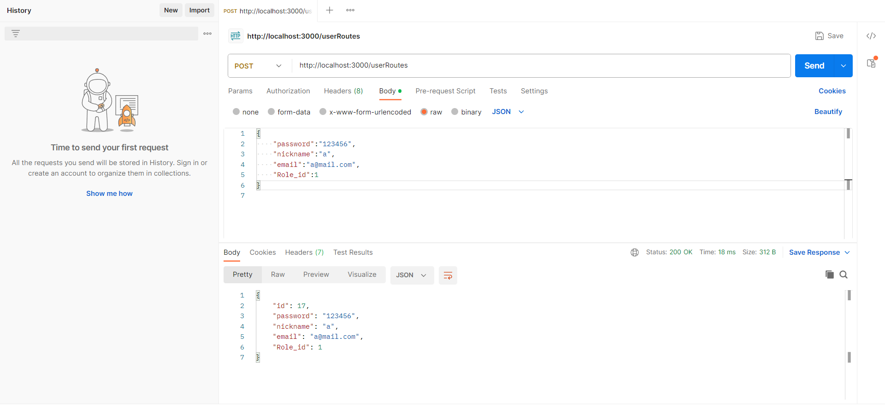
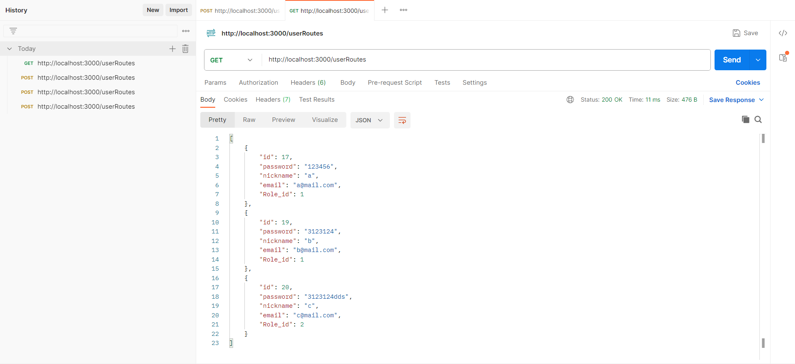
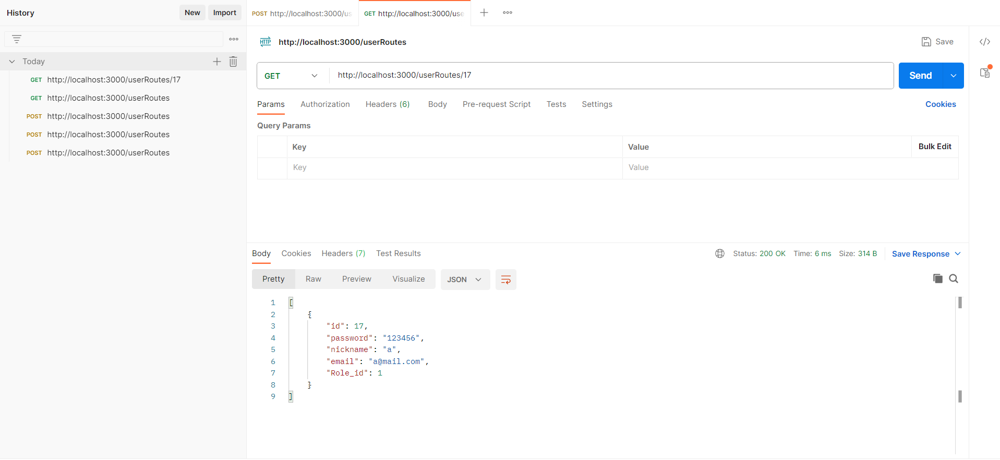
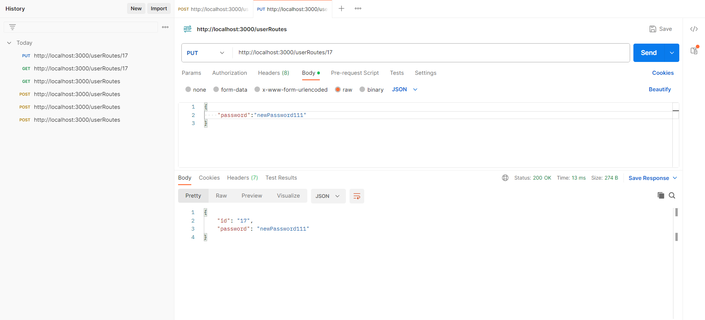
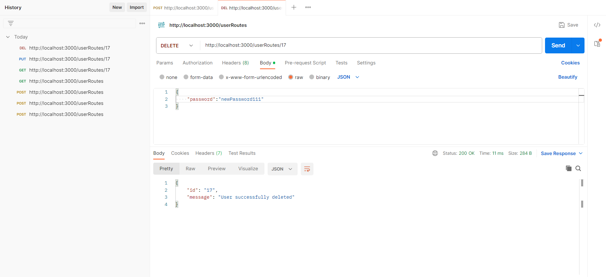
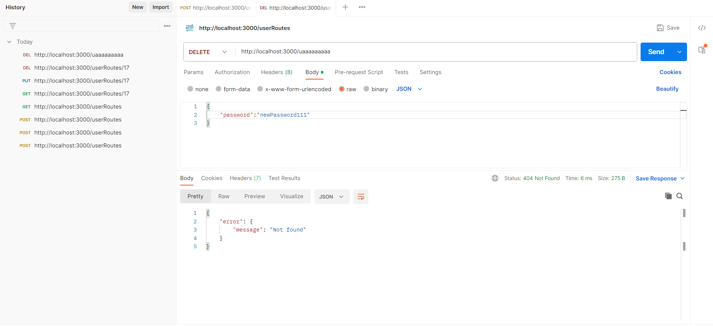

# Тестування працездатності системи

## Запуск сервера   

## Створення користувача

## Отримати всіх користувачів

## Отримати користувача

## Оновлення паролю користувача

## Видалення користувача

## Помилка

